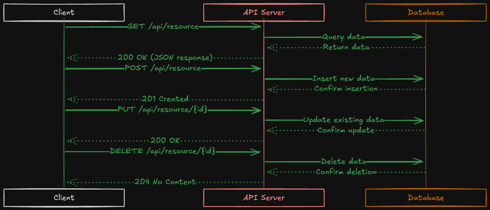

# Rest API Documentation

Welcome to the **Rest API Documentation** repository! This repository contains detailed documentation for building and managing RESTful APIs using Django Rest Framework (DRF) with authentication, serialization, and various advanced features like filtering, pagination, and caching.

This documentation is organized into several key sections to help developers build scalable and maintainable APIs for applications like online learning platforms, It covers topics such as authentication, search filtering, API serialization, validation, and much more.

#### General API Docs

- [Command](./documents/COMMAND.MD)
- [Database](./documents/DATABASE.MD)
- [DRF](./documents/DRF.MD)
- [Response Types](./documents/RESONSE_TYPES.md)
- [Rest API](./documents/REST_API.MD)
- [Rest Principles](./documents/REST_PRINCIPLES.MD)
- [Setup](./documents/SETUP.md)

#### Authentication

- [Djoser](./documents/Authentication/DJOSER.MD)
- [JWT](./documents/Authentication/JWT.MD)
- [Throttling](./documents/Authentication/THROTTLING.MD)
- [Token](./documents/Authentication/TOKEN.MD)

#### Filter/Search

- [Caching](./documents/filter-search/CACHING.MD)
- [Filtering](./documents/filter-search/FILTERING.MD)
- [Ordering](./documents/filter-search/ORDERING.MD)
- [Pagination](./documents/filter-search/PAGINATION.MD)

#### Serialization

- [Renderers](./documents/serialization/RENDERERS.MD)
- [Sanitization](./documents/serialization/SANITIZATION.MD)
- [Serializers](./documents/serialization/SERIALIZERS.MD)
- [Validation](./documents/serialization/VALIDATION.MD)
- [API View](./documents/serialization/API_VIEW.MD)

## HTTPS

While making a request to a browser or submit a form, our data is transmitted using `HTTP` or `HTTPS`.

To make a request-response successful, we need two parts, one to make a request (client) and the other one to send an answer to the request (server).
`HTTPS` is secured version of `HTTP`, where client's computer encrypts data before sending the request and the server decrypts the request and sends an encrypted response.

# ## HTTP methods (http verbs)

HTTP methods or request types tell the API endpoint what it should do with the resources. It defines the action.
there are five common methods

### 1. GET

To get the resources from the server

### 2. POST

To post a content

### 3. UPDATE

To update the content

### 4. PATCH

To partially update the content

### 5. DELETE

To delete the content

## HTTP Request

```table

It contains different kind of information that the user's browser sends as encoded data.
A typical http request contains the following

- http version type
- url
- http method
- request headers
- optional body

| **HTTP Method** | **Action**                                                                                                                                              |
|-----------------|----------------------------------------------------------------------------------------------------------------------------------------------------------|
| **GET**         | Returns the requested resource. If the resource is not found, it returns a 404 Not Found status code.                                                    |
| **POST**        | Creates a new resource. It includes a payload (JSON or Form URL encoded data). Multiple resources can be created, but it's not considered best practice. |
| **PUT**         | Replaces an existing resource with the provided data. The request contains all data for the resource and updates the resource entirely.                  |
| **PATCH**       | Updates part of an existing resource. Unlike PUT, it only modifies certain fields of the resource.                                                       |
| **DELETE**      | Deletes the specified resource.                                                                                                                          |
```

We are making a request, our data is passed to the server through http body.
request headers contains extra information for the server to make a decision, some examples of request headers are `cookies`, `user-agents` and `referrers`.

```table
| **HTTP Method** | **Sample Endpoints**                       | **Query String / Payload**                                                                                                                                                                                                                                           |
|-----------------|--------------------------------------------|-----------------------------------------------------------------------------------------------------------------------------------------------------------------------------------------------------------------------------------------------------------------------|
| **GET**         | `/api/courses`<br>`/api/courses/1`<br>`/api/courses?category=programming`<br>`/api/courses?perpage=3&page=2`                   | A GET call doesn’t need a payload. However, it can include query string parameters to filter the API output (e.g., by category or pagination).                                                                                                                       |
| **POST**        | `/api/courses`<br>`/api/enrollments`        | Here’s a sample JSON payload for the `/api/courses` endpoint to create a new resource: <br><br> `{ "title": "Python for Beginners", "duration": 30, "category": "programming" }`                                                                                       |
| **PUT**         | `/api/courses/1`<br>`/api/enrollments/1`    | Here’s a sample JSON payload for the `/api/courses/1` endpoint to completely replace it: <br><br> `{ "title": "Advanced Python", "duration": 45, "category": "programming" }`                                                                                           |
| **PATCH**       | `/api/courses/1`<br>`/api/enrollments/1`    | Here’s a sample JSON payload for the `/api/courses/1` endpoint to partially update the resource: <br><br> `{ "duration": 35 }`                                                                                                                                         |
| **DELETE**      | `/api/courses`<br>`/api/courses/1`<br>`/api/enrollments`<br>`/api/enrollments/1` | When a DELETE call is sent to a collection endpoint like `/api/courses`, it should delete the entire collection. When sent to a specific resource like `/api/courses/1`, it deletes only that resource.                                                                 |

```

## HTTP Response

It consists of information that the browser uses to display the content for the user.
Sending appropriate status codes with every API response is essential and Every status code has meaning
the response contains

- requested resource
- content length
- content type
- headers like cookies
- http status code
- time that the content was last modified
- ETags

### Response types

The most common response types involved with REST APIs are JSON, XML, plain text, and sometimes YAML.
While making an API call, the client can specify its desired response format with the Accept HTTP header. And that header should be considered to deliver the result in that format using the render classes. Here’s a list of HTTP headers for different response types.

```table
| **Response Type** | **Request Header**                         |
|-------------------|--------------------------------------------|
| **HTML**          | `Accept: text/html`                        |
| **JSON and JSONP**| `Accept: application/json`                 |
| **XML**           | `Accept: application/xml`<br>`Accept: text/xml` |
| **YAML**          | `Accept: application/yaml`<br>`Accept: application/x-yaml`<br>`Accept: text/yaml` |

```

### HTTP Status Code

they provide extra information to the browser about the resource that was requested for.
for instance `200` means everything is ok and many other status code.

- `100-199` for information messages
- `200-299` for successful responses
- `300-399` for redirection information
- `400-499` for errors on client side
- `500-599` for errors on server side

```table
| **Status Code Range** | **Purpose**                                                                                                                                                                                                                   |
|-----------------------|-------------------------------------------------------------------------------------------------------------------------------------------------------------------------------------------------------------------------------|
| **100-199**           | This range is mainly used to pass on information. For example, a 102 – Processing status code can be returned to inform the client that the result isn't ready and should be checked again.                                      |
| **200-299**           | These are success codes. For example, 200 – OK for a successful PUT, PATCH, or DELETE call, and 201 – Created for a successful POST call when a resource has been created.                                                     |
| **300-399**           | These are redirection codes. For instance, 301 – Moved Permanently can redirect the client to a new endpoint if the original one has changed.                                                                                  |
| **400-499**           | Client error codes. Common examples include: 404 – Not Found for non-existent resources, 400 – Bad Request for invalid payloads, 401 – Unauthorized for authentication issues, and 403 – Forbidden for unauthorized actions.    |
| **500-599**           | Server error codes, indicating something went wrong on the server side. These are usually caused by unhandled exceptions or server misconfigurations. API developers should aim to avoid 5xx errors by handling edge cases.      |

```

<figure>

<figcaption><p align="center">client-sever request-response cycle</p><figcaption>
</figure>

### Resources

- [http](https://httpbin.org/#/Status_codes)
- [status-code](https://developer.mozilla.org/en-US/docs/Web/HTTP/Status)

### Tools

- [insomnia](https://docs.insomnia.rest/)
- [postman](https://www.postman.com/)
- [psotman-docs](https://www.postman.com/postman/published-postman-templates/documentation/ae2ja6x/postman-echo?ctx=documentation)

## Getting Started

### Prerequisites

- Python 3.x
- Django
- Django Rest Framework (DRF)

### Installation

To get started with this repository, clone it to your local machine and follow the instructions in the `SETUP.md` document for detailed setup steps.

### Features

- **Authentication**: Covers JWT, Token-based authentication, and Djoser integration.
- **Filtering and Search**: Learn how to implement powerful filtering and searching mechanisms.
- **Serialization**: Detailed explanations of how to serialize and validate your API data.
- **Pagination and Throttling**: Manage large datasets efficiently with pagination and control API usage with throttling.

Feel free to explore each document in the repository for comprehensive guidelines and code examples to help you integrate these features into your own projects.

---

If you have any questions, suggestions, or issues, please open a pull request or an issue in the repository.
