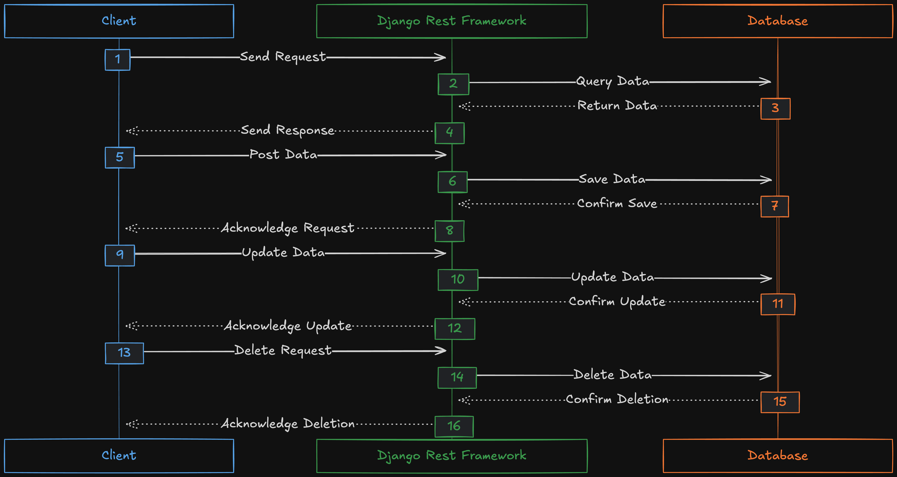

## Django Rest Framework (DRF)

A toolkit that is built on top of django, it helps us to build APIs quickly with the utility classes and methods it provides.

We frequently need to retrieve data from database, process, convert it to json and sends it back to the client, all of them is done using `DRF`.

#### Serialization

The process of converting data to json, it converts complex data types to python data types that can be rendered in `JSON, XML, ... , other` data types.

### Advantages:

- easy to integrate it into our django app
- it comes with its own request and response object wrappers around http response and request object from django.
- it have human readable status codes, like Status.HTTP_200_OK
- easily can develop an authentication system for our app
- can enable social connection to authenticate the user

<figure>

<figcaption>
DRF Rest API
<figcaption>
</figure>
