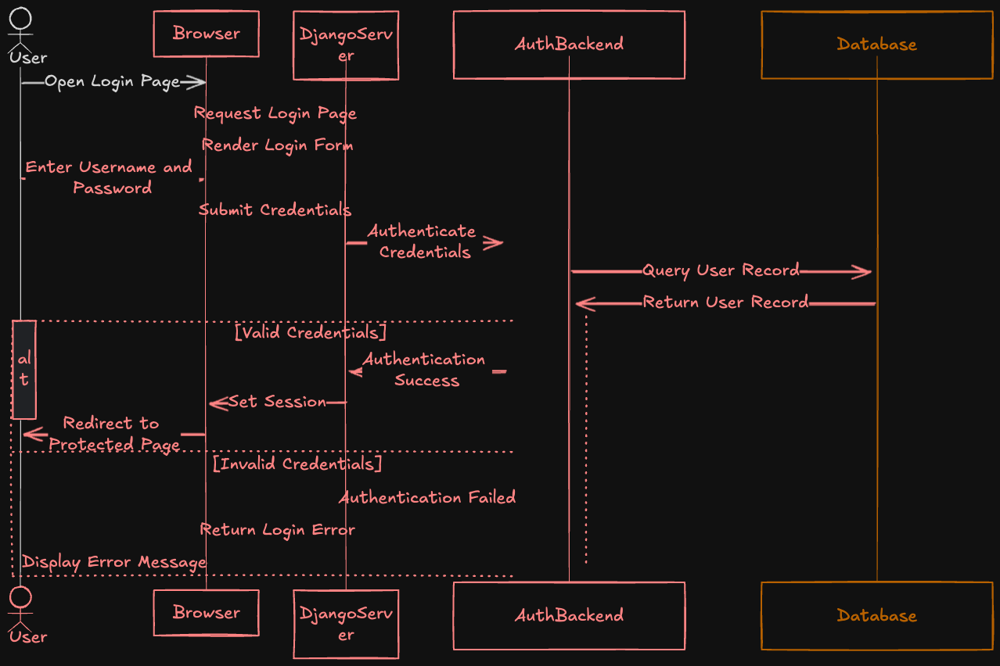

## Some of the best practices to follow while developing an API

1. keep it simple
2. one API, one job
3. it should contain filtering, ordering, and pagination
4. api should be cacheable
5. rate limiting
6. monitoring the latency to make sure the users get the responses quickly

## Security

### 1. secure socket layer

It encrypts and protects our data when it leaves the web server and by using an SSL certificate, our data can be served using https.

### 2. Signed URLs

It makes sure that all request comes from our application.
Every time, we call an API, a piece of text called a signature is included with the URL, and server-side code can verify the signature and ensure that the call comes from an authentic source.

Signed URLs give someone limited access to a specific resource for a brief period of time.

`HMAC` is a popular signing mechanism that creates a signature.

### 3. Token-based authentication

Using HTTP-based authentication can be cumbersome as every time we make a request, the user's credentials should be included, However, in token-based authentication, we do it once.
We send the credentials to signed URLs and one token is generated out of that and every time we make a request, we use the same token for authentication, we use JWT for this purpose.

### 4. HTTP code

- `401`: unauthorized, the user name and password do not match.
- `403`: forbidden, you are an authenticated user but do not have the authority to do the action.

### 5. cross-origin resource sharing (cors)

Configure the Cors headers to accept the calls from specific domains.

### 6. Firewalls

Use a firewall application to make sure a specific IP address can make the call.

## Access control

With access control, we can specify which users are allowed to make requests and what kind of information they can see.

- `Role`: collection of privileges
- `Privileges`: authority to do a task

For instance, a user has the privilege of making an order and a manager has the privilege of seeing the user's information.

Roles and privileges can be given to users and groups on the Django admin panel and later the code for what each can do based on which group they are in.

#### authentication

Authentication gets us in and authorization allows or prevents us from doing something.

When the username and password match, the website recognizes the user and sets some cookies in the user’s browser. When the user visits another page on that website, the browser sends those cookies within the HTTP request header. The website recognizes the cookies as well as server-side session data and therefore doesn’t ask for credentials until the user logs out.

Then the API server gives it a bearer token. From there, the client includes the bearer token with every API call that it places. The API server verifies it and then allows the client to perform the action or not. This is where authorization comes in, but more on this later.

### authorization

Authorization lets you act. It checks after authentication if the user has the proper privileges to perform some tasks.

<figure>

<figcaption>
DRF Rest API
<figcaption>
</figure>
