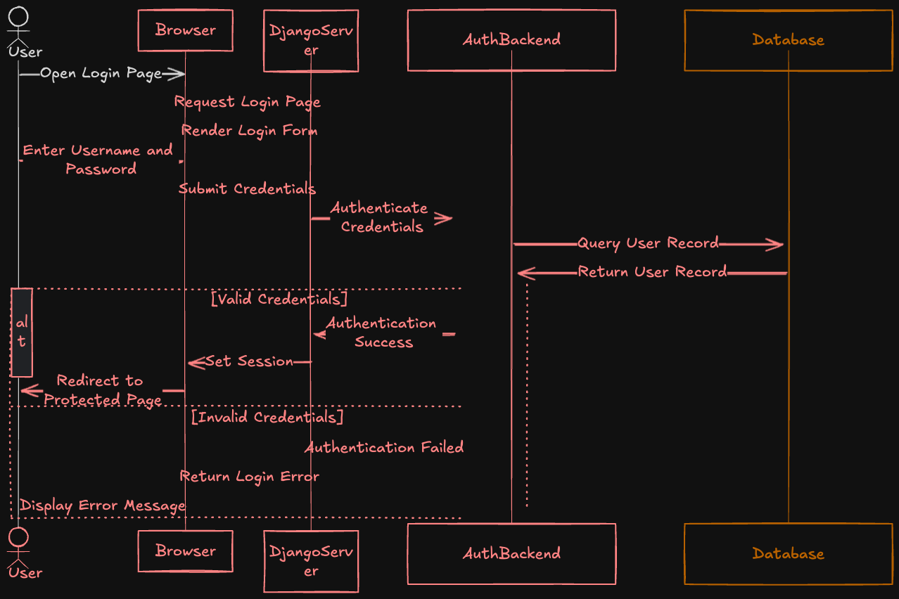

# 🌟 Best Practices for API Development

## 🛠 General Best Practices

### 1️⃣ Keep it Simple

- The API design should be intuitive and straightforward.

### 2️⃣ One API, One Job

- Each API endpoint should handle a single, clear purpose.

### 3️⃣ Include Filtering, Ordering, and Pagination

- Make it easy to retrieve data efficiently:
  - **Filtering**: `/users?role=admin`
  - **Ordering**: `/users?sort=created_at`
  - **Pagination**: `/users?page=1&limit=10`

### 4️⃣ Make the API Cacheable

- Use caching mechanisms (e.g., HTTP cache headers) to reduce server load and improve response times.

### 5️⃣ Implement Rate Limiting

- Protect your API from abuse by limiting the number of requests per user/IP.

### 6️⃣ Monitor Latency

- Regularly track API latency to ensure fast responses and a good user experience.

---

## 🔒 Security Best Practices

### 1️⃣ Secure Socket Layer (SSL)

- **SSL** encrypts data in transit and ensures secure communication.
- Use HTTPS by applying an SSL certificate.

### 2️⃣ Signed URLs

- Include a **signature** in API requests to verify their authenticity.
- Example: Use **HMAC** to sign URLs, granting temporary access to specific resources.

### 3️⃣ Token-Based Authentication

- Replace traditional credentials with a **token**.
  - Use **JWT** (JSON Web Tokens) to manage secure sessions.
  - Send the token with each request for authentication.

### 4️⃣ HTTP Status Codes for Security

- `401 Unauthorized`: The user credentials are incorrect.
- `403 Forbidden`: The user is authenticated but lacks the required privileges.

### 5️⃣ Cross-Origin Resource Sharing (CORS)

- Configure CORS headers to allow API calls only from specific, trusted domains.

### 6️⃣ Firewalls

- Use firewalls to restrict API access to specific IP addresses.

---

## 🛡 Access Control

### **What is Access Control?**

- Define which users can perform actions and what data they can access.

| Term          | Description                            |
| ------------- | -------------------------------------- |
| **Role**      | A collection of privileges.            |
| **Privilege** | Permission to perform a specific task. |

### Example:

- **User Role**: Can place an order.
- **Manager Role**: Can view all user data.

In **Django**, roles and privileges can be configured in the admin panel and managed through code.

---

## 🔑 Authentication & Authorization

### **Authentication**

- Validates the user's identity (e.g., username and password).
- Once authenticated, the server provides a **bearer token** for subsequent API calls.

### **Authorization**

- Determines if an authenticated user has the necessary privileges to perform a task.
- Example:
  - A user with the "admin" role can delete resources, but a "user" role cannot.

---

### 🖼 Authentication vs Authorization

<figure>
  
  <figcaption>
Authentication vs Authorization in DRF Rest API
</figcaption>
</figure>

---
