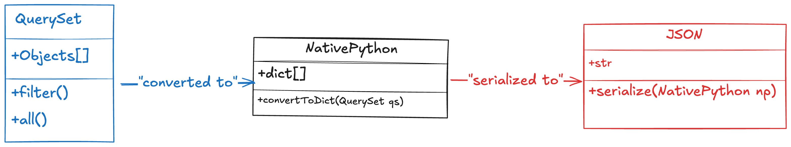

## Serializers

serializers convert django models or objects into more readable format like `JSON`, `XML` or more readable format.

when we pull data from database, we cannot present them to the clients in their original format, serializers are used to convert the data from a model to a more readable format.

for instance, from complex data types, such as querysets and model instances, into native Python data types that can easily be rendered into JSON, XML, or other content types

<figure>

<p align="center">serialization working progress</p>
</figure>

## Deserializer

deserializer parses the existing json data and convert it to an existing model.

by parsed data we mean the data have been converted from one format to another formate which is more readable and usable.

Data is often received in formats like JSON or XML (which are text-based).
Parsing is the process of interpreting or converting that text-based data into native Python data types (like dictionaries, lists, integers, etc.) so the program can work with it directly.

When data is received in an HTTP request (such as JSON data in a POST request), it needs to be parsed to convert it from the raw request body into native Python types.
After parsing, the data can be deserialized into more complex Django data types, like models, using serializers.

#### Example

```json
{
	"title": "Django for Beginners",
	"description": "An introductory Django course"
}
```

```py
{
    "title": "Django for Beginners",
    "description": "An introductory Django course"
}

```

```py
data = request.data
 # parsed data
serializer = CourseSerializer(data=data)
if serializer.is_valid():
    # creates a Course instance
    course = serializer.save()
```

#### serializers.py

create a file named `serializers.py` in the app and put all the serializers related code in there.
only the attributes we added here will be shown or sent to the client, even if we have many more attributes in our model.
To show them all, add them in serializer.

```py
from rest_framework import serializers
class CourseSerializer(serializers.Serializer):
    id = serializers.IntegerField()
    course_title = serializers.CharField(max_length=149)
```

now by adding `courses` list to our serializer, the list will converted to `JSON`.

```py
# views.py
from django.shortcuts import render
from rest_framework.response import Response
from rest_framework import status
from rest_framework.decorators import api_view
from rest_framework.views import APIView
from .models import Course
from .serializers import CourseSerializer
# create your views here.
class Courses(APIView):
    def get(self, request):
        courses = Course.objects.all()
        print(type(courses))
        # covert a queryset to json, many=True is essential here.
        serialized_courses = CourseSerializer(courses, many=True)
        return Response(serialized_courses.data)

```

```py
# serializers.py
class CourseSerializer(serializers.Serializer):
    id = serializers.IntegerField()
    course_title = serializers.CharField(max_length=149)
    price = serializers.FloatField()
```

##### `APIView`: A class-based view provided by DRF that allows us defining HTTP methods like GET, POST, PUT, etc.

## Model serializers

instead of going through writing all the attributes again, easily we can use meta class and get all the fields from original model, make sure you name it `fields.`

```py
from rest_framework import serializers
from .models import Course
class CourseSerializer(serializers.ModelSerializer):
    class Meta:
        model = Course
        fields=["id","course_title","price", "instructor_name"]
```

instead of `Serializer`, we use `ModelSerializer`, it gives us the ability to add additional fields or change the name of the fields inside serializer class.

```py
from rest_framework import serializers
from .models import Course
class CourseSerializer(serializers.ModelSerializer):
    course_price = serializers.IntegerField(source = "price")
    class Meta:
        model = Course
        fields=["id","course_title","price", "price"]
```

## Foreign key relation ship

```py
# models.py
from django.db import models
class Category(models.Model):
    slug = models.SlugField()
    title  = models.CharField(max_length=120)

    def __str__(self):
        return self.title

class Course(models.Model):
    title = models.CharField(max_length=120)
    instructor = models.CharField(max_length=120)
    price = models.FloatField()
    category = models.ForeignKey(Category, on_delete=models.PROTECT)

```

add the category field to the fields

```py
# serializers.py
class CourseSerializer(serializers.ModelSerializer):
    course_price = serializers.IntegerField(source = "price")
    price_after_tax = serializers.SerializerMethodField(method_name="calculate_tax")
    category = serializers.StringRelatedField()

    class Meta:
        model = Course
        fields=["id","title","course_price","price_after_tax","category"]
    def calculate_tax(self, course:Course):
        return Decimal(course.price) * Decimal(1.1)
```

we can also add the whole category model

```py
# serializers.py
from rest_framework import serializers
from decimal import Decimal
from .models import Course, Category

class CategorySerializer(serializers.ModelSerializer):
    class Meta:
        model = Category
        fields=["id", "slug","title"]

class CourseSerializer(serializers.ModelSerializer):
    course_price = serializers.IntegerField(source = "price")
    price_after_tax = serializers.SerializerMethodField(method_name="calculate_tax")
    category = CategorySerializer()

    class Meta:
        model = Course
        fields=["id","title","price","price_after_tax","category"]
    def calculate_tax(self, course:Course):
        return Decimal(course.price) * Decimal(1.1)
```

### Displaying relationships using depth=1.

by adding `depth=1`, we are saying that display all the fields related to a relationship to this model, we will get exactly same output as before when we used `CategorySerializer`.

```py
from rest_framework import serializers
from decimal import Decimal
from .models import Course, Category

class CourseSerializer(serializers.ModelSerializer):
    price_after_tax = serializers.SerializerMethodField(method_name="calculate_tax")
    class Meta:
        model = Course
        fields=["id","title","price","price_after_tax","category"]
        depth=1

    def calculate_tax(self, course:Course):
        return Decimal(course.price) * Decimal(1.1)
```

### What does depth=1 mean?

`depth=1` means that when serializing a model that has foreign key relationships (in this case, Course has a foreign key relationship to Category), Django REST Framework will automatically include the related object's data in the serialization up to one level deep.

## Deserialization and validation

this is the opposite of serialization and it happens when the client sends some data to our `api` end points and `drf` maps that data to an existing model.

### Posting data

```py
#hooshmandlab/serializer.py
class CategorySerializer(serializers.ModelSerializer):
    class Meta:
        model = Category
        fields = ["id", "slug","title"]

class CourseSerializer(serializers.ModelSerializer):
    price_after_tax = serializers.SerializerMethodField(method_name="calculate_tax")
    # category = CategorySerializer(read_only=True)
    class Meta:
        model = Course
        fields=["id","title","price","price_after_tax","category"]

    def calculate_tax(self, course:Course):
        return Decimal(course.price) * Decimal(1.1)
```

Add post method in `views.py`

```py
from django.shortcuts import render
from CourseListAPI.models import Course
from .serializers import CourseSerializer
from rest_framework.response import Response
from rest_framework.views import APIView
# Create your views here
class Courses(APIView):
    def post(self,request):
        data = request.data
        serialized_data = CourseSerializer(data=data)
        if serialized_data.is_valid():
            serialized_data.save()
            return Response({"message":"data created successfully"})
        return Response({"message":"data cannot be saved"})
```

##### `request.data`: it captures the data sent in the body of POST request.

`CourseSerializer(data=data)`: The CourseSerializer is used to validate and transform the incoming data (which is JSON) into the Python objects necessary to create a Course model instance.

`data=data`: Indicates that the serializer will work with the raw data received in the request.

`is_valid()`: This method checks whether the incoming data satisfies all the constraints and validation rules defined in the CourseSerializer and Course model (e.g., required fields, field types, etc.). If the data is valid, the method returns True.

`save()`: This method is responsible for creating a new Course instance and saving it to the database, using the validated data.

As you can see, before saving the data, we are passing through a serializer to check against `CourseSerializer`, if it is valid and contains all necessary fields, only then save it to the model.
this process is known as deserialization.

` fields=["id","title","price,"price_after_tax","category"]`, note down how you have defined the fields in serializer, when posting a data, the field names should match the ones that are defined in serializer, for instance, in our original model we had `price`, but here we have changed it `course_price`, hence, when adding the data in the form, it should be `course_price` and also for category, make sure it is existed in our database.

```json
{
	"title": "Intro Linear Algebra",
	"price: 200,
	"category": 2
}
```

### read_only and write_only

When we add `read_only and write_only` to our serializer field, if it is `read_only`, it means, use it only when retrieving the data.

`category_id (Write-only)`:

if it is `write_only`, it means it is not returned when retrieving the data but it is allowed or required when creating or updating the data.
and role of `category_id` here is that when posting the data, it is not required to enter the entire category fields, `category_id` is sufficient here to link the data to a category present in our database.

```py
from rest_framework import serializers
from CourseListAPI.models import Course, Category
from decimal import Decimal
class CategorySerializer(serializers.ModelSerializer):
    class Meta:
        model = Category
        fields = ["id", "slug","title"]

class CourseSerializer(serializers.ModelSerializer):
    course_price = serializers.IntegerField(source = "price")
    price_after_tax = serializers.SerializerMethodField(method_name="calculate_tax")
    category = CategorySerializer(read_only=True)
    category_id = serializers.IntegerField(write_only=True)
    class Meta:
        model = Course
        fields=["id","title","price","price_after_tax","category", "category_id"]
    def calculate_tax(self, course:Course):
        return Decimal(course.price) * Decimal(1.1)
```

when posting the data, the fields should match the serializer fields.

```py
{
	"title": "Intro Linear Algebra",
	"price: 200,
    "category_id":2
}
```
