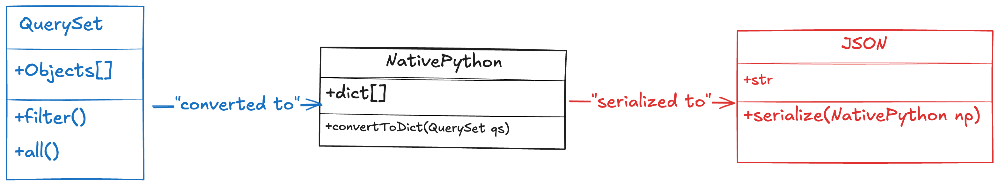

# Serializers

serializers convert django models or objects into more readable format like `JSON`, `XML`.

when we pull data from database, we cannot present them to the clients in their original format, serializers are used to convert the data from a model to a more readable format.

for instance, from complex data types, such as querysets and model instances, into native Python data types that can easily be rendered into JSON, XML, or other content types

<figure>

<p align="center">serialization working progress</p>
</figure>

```py
from rest_framework import APIView
from rest_framework.response import Response
class CourseView(APIView):
    def get(self, request):
        courses = Course.objects.all()
        return Response(course.values())
```

`.values()` method is a QuerySet method that returns a list of dictionaries, where each dictionary represents a row in the database, and the keys in the dictionary are the column names (field names in the model).

We ara using DRF and it takes care of displaying the data in json format.

#### When to Use .values()?

- Simple Read-Only Use Cases:

If we need to quickly fetch raw data for internal use and don't need validation or customization.

- Ad Hoc Queries:
  When we only need specific fields or lightweight data for a quick operation

#### When to Use Serializers

##### API Responses:

Always use serializers for public-facing APIs to ensure clean, validated, and customizable output.

##### Complex Relationships:

For nested or related objects, serializers handle these efficiently and present data in an organized manner.

| Feature               | `.values()`                      | Serializers                             |
| --------------------- | -------------------------------- | --------------------------------------- |
| **Data Format**       | Raw dictionaries                 | JSON-serializable, customizable objects |
| **Validation**        | None                             | Ensures data integrity and constraints  |
| **Related Fields**    | Raw IDs                          | Can serialize nested or related objects |
| **Custom Formatting** | Limited (field selection only)   | Fully customizable                      |
| **Performance**       | Can be inefficient for relations | Optimized with serializer methods       |
| **Maintainability**   | Hard to extend                   | Easy to extend and version              |

### 1. Raw Dictionaries

Raw dictionaries are the direct representation of database rows returned by Django's ``.values()` method. These are basic Python dictionaries and map directly to the database fields.

##### Characteristics

- Flat structure: Only includes database fields and their values.
- No additional processing: Direct mapping of fields to their values.
- Raw IDs for relations: Foreign keys are represented by their raw ID values.
- No validation or transformation: The data is as-is from the database.

```py
[
    {'id': 1, 'name': 'Math', 'instructor_id': 10},
    {'id': 2, 'name': 'Science', 'instructor_id': 12}
]

```

### 2. JSON-Serializable, Customizable Objects

These are created using Django Rest Framework (DRF) serializers. They are Python objects processed to meet API requirements and can include nested or related data, validation, and custom transformations.

##### Characteristics

- Rich structure: Can include nested or related objects.
- Customizable fields: Can rename fields, exclude fields, or transform data.
- Validated data: Ensures that data conforms to specific rules.
- JSON-serializable: Directly formatted for API responses.

```py
[
    {'id': 1, 'name': 'Math', 'instructor_name': 'JohnDoe'},
    {'id': 2, 'name': 'Science', 'instructor_name': 'JaneDoe'}
]

```

### How to use serializers

##### create a serializers.py file

create a file named `serializers.py` in the app and put all the serializers related code in there.
each field that is written in `serializers.py` file should match what is written in `models.py`.
only the attributes we added here will be shown or sent to the client, even if we have many more attributes in our model.
To show them all, add them in serializer.

```py
# serializers.py
from rest_framework import serializers
class CourseSerializer(serializers.Serializer):
    id = serializers.IntegerField()
    course_title = serializers.CharField(max_length=149)
    price = serializers.FloatField()
```

##### use serializer in model

now by adding `courses` list to our serializer, the list will converted to `JSON`.

```py
# views.py
from rest_framework.response import Response
from rest_framework.views import APIView
from .models import Course
from .serializers import CourseSerializer
# create your views here.
class Courses(APIView):
    def get(self, request):
        courses = Course.objects.all()
        print(type(courses))
        # covert a queryset to json, many=True is essential here.
        serialized_courses = CourseSerializer(courses, many=True)
        return Response(serialized_courses.data)

```

##### `APIView`: A class-based view provided by DRF that allows us defining HTTP methods like GET, POST, PUT, etc.

# Model serializers

instead of going through writing all the attributes again, easily we can use meta class and get all the fields from original model, make sure you name it `fields.`

```py
# serializers.py
from rest_framework import serializers
from .models import Course
class CourseSerializer(serializers.ModelSerializer):
    class Meta:
        model = Course
        fields=["id","course_title","price", "instructor_name"]
```

#### instead of `Serializer`, we use `ModelSerializer`, it gives us the ability to add additional fields or change the name of the fields inside serializer class.

```py
# serializers.py
from rest_framework import serializers
from .models import Course
class CourseSerializer(serializers.ModelSerializer):
    # price name changed to course_price
    course_price = serializers.IntegerField(source = "price")
    class Meta:
        model = Course
        # nstructor_name is dropped now, this field will be sent as part of API response.
        fields=["id","course_title","price", "course_price"]
```

## Foreign key relation ship

```py
# models.py
from django.db import models

class Category(models.Model):
    slug = models.SlugField()
    title  = models.CharField(max_length=120)
    def __str__(self):
        return self.title

class Course(models.Model):
    title = models.CharField(max_length=120)
    instructor = models.CharField(max_length=120)
    price = models.FloatField()
    category = models.ForeignKey(Category, on_delete=models.PROTECT)

```

#### add the category field to the fields

```py
# serializers.py
class CourseSerializer(serializers.ModelSerializer):
    price_after_tax = serializers.SerializerMethodField(method_name="calculate_tax")
    category = serializers.StringRelatedField()

    class Meta:
        model = Course
        fields=["id","title","course_price","price_after_tax","category"]

    # adding a method inside serializer
    def calculate_tax(self, course:Course):
        return Decimal(course.price) * Decimal(1.1)
```

#### we can also add the whole category model

```py
# serializers.py
from rest_framework import serializers
from .models import Course, Category

class CategorySerializer(serializers.ModelSerializer):
    class Meta:
        model = Category
        fields=["id", "slug","title"]

class CourseSerializer(serializers.ModelSerializer):
    category = CategorySerializer()
    class Meta:
        model = Course
        fields=["id","title","price","category"]


```

## Displaying relationships using depth=1.

by adding `depth=1`, we are saying that display all the fields related to a relationship to this model, we will get exactly same output as before when we used `CategorySerializer`.

```py
from rest_framework import serializers
from .models import Course, Category
class CourseSerializer(serializers.ModelSerializer):
    class Meta:
        model = Course
        fields=["id","title","price","category"]
        # adding depth=1, helps us to go one level deeper and return the the items
        depth=1

```

### What does depth=1 mean?

`depth=1` means that when serializing a model that has foreign key relationships (in this case, Course has a foreign key relationship to Category), Django REST Framework will automatically include the related object's data in the serialization up to one level deep.
